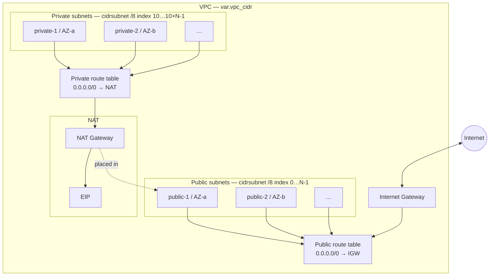
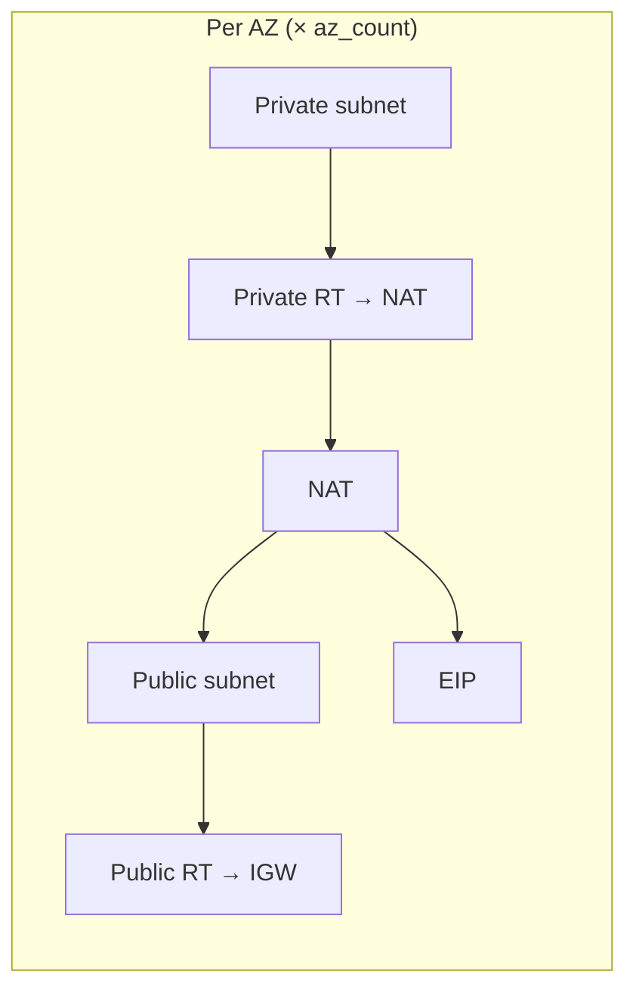

# Module: `vpc`

Creates a **multi-AZ** VPC with:

- **Public** subnets (one `/24` per AZ under the VPC CIDR: indices `0 … az_count-1`)
- **Private** subnets (indices `10 … 10+az_count-1` — e.g. `10.0.10.0/24` when VPC is `10.0.0.0/16`)
- **Internet gateway** + public route table
- **NAT gateway(s)** — one shared (`single_nat_gateway = true`, default) or one per AZ

Subnet tags include `kubernetes.io/role/elb` / `kubernetes.io/role/internal-elb` for **EKS** load balancers. Optional `eks_cluster_name` adds the `kubernetes.io/cluster/<name>` tag.

## Inputs (summary)

| Name | Default | Notes |
|------|---------|--------|
| `name_prefix` | — | Required; used in Name tags |
| `vpc_cidr` | `10.0.0.0/16` | Must fit `/8` split used by `cidrsubnet(..., 8, …)` |
| `az_count` | `3` | Uses first N AZs (capped by what the region exposes); max **4** |
| `single_nat_gateway` | `true` | `false` = NAT per AZ |
| `eks_cluster_name` | `null` | Set when subnets must be tagged for a named EKS cluster |

## Architecture

### Default (`single_nat_gateway = true`)

One **NAT Gateway** in the **first** public subnet; **one** private route table shared by all private subnets. **One** public route table shared by all public subnets.

Traffic: **private** → private RT → **NAT** → **public subnet** → public RT → **IGW** → internet. **Public** workloads use public RT → IGW directly.

### `single_nat_gateway = false`

Same layout, but **one EIP + one NAT per AZ**, each NAT in the **matching** public subnet; **one private route table per AZ** associated with the private subnet in that AZ (default route to the NAT in the same AZ).

